# likhadb

A progressively-layered, in-memory vector database written in Rust.
Tier 1 is an exact brute-force search MVP. Tier 2 adds an IVF approximate index.
Tier 3 (HNSW) slots in behind the same `VectorIndex` trait without touching the public API or store layer.

<p align="center">
  
</p>

## Overview

likhadb stores float vectors alongside arbitrary JSON payloads, searches them with
k-nearest-neighbour queries, and filters candidates using a simple JSON predicate language.
The internal design is a clean stack of crates with one extension seam — the `VectorIndex`
trait — so index implementations (FlatIndex, IvfIndex, future HNSW) slot in without changing
the store or API layers.

### MVP internals

<p align="center">
  
</p>

## Workspace layout

```
likhadb/
├── crates/
│   ├── likhadb-core/    # Primitives: VecId, Vector, ScoredResult, Metric, distance kernels
│   ├── likhadb-index/   # VectorIndex trait + FlatIndex + IvfIndex + HnswIndex
│   ├── likhadb-store/   # Collection, CollectionManager, MetaStore (JSON filtering)
│   ├── likhadb-persist/ # Snapshot serialization — save/load CollectionManager to disk
│   └── likhadb-bench/   # Criterion benchmarks
└── images/
```

| Crate | Role |
|---|---|
| `likhadb-core` | Shared primitives and error types — no index logic |
| `likhadb-index` | `VectorIndex` trait (the extension seam) + `FlatIndex` + `IvfIndex` + `HnswIndex` |
| `likhadb-store` | `Collection` wraps an index + metadata; `CollectionManager` names them |
| `likhadb-persist` | Point-in-time snapshots via `bincode`; `PersistExt` trait adds `save`/`load` to `CollectionManager` |
| `likhadb-bench` | Criterion benchmarks for 1 k / 10 k / 100 k vectors |

## Features

### Tier 1 — Exact brute-force (`FlatIndex`)

- **Exact k-NN search** via brute-force over all stored vectors
- **Three distance metrics** — Cosine, Dot product, L2 (Euclidean)
- **JSON metadata payloads** stored alongside each vector
- **Metadata filtering** — `eq`, `ne`, `exists` predicates evaluated at query time
- **Serde-ready result types** — `ScoredResult` serialises/deserialises out of the box
- **SIMD-accelerated search** via `simsimd` (NEON on M2/aarch64, AVX-512 on x86) with scalar fallback
- **Parallel search** via `rayon` — each thread builds a local top-k heap; heaps are merged at the end
- **No unsafe code**, no `unwrap()` in library paths

### Tier 3 — Graph-based approximate search (`HnswIndex`)

- **HNSW (Hierarchical Navigable Small World)** — multi-layer proximity graph; greedy beam search from highest layer down
- **Sub-millisecond recall@10** on 100k vectors — faster than IVF at equivalent recall, with higher memory footprint
- **Configurable build/query tradeoff** via `m` (graph density), `ef_construction` (build quality), and `ef_search` (query recall)
- **Tombstone deletes** — deleted nodes remain as traversal stepping-stones; excluded from results
- **Same API** — drop-in replacement via `create_hnsw_collection`
- **All three metrics** — Cosine, Dot, L2

### Tier 2 — Approximate search (`IvfIndex`)

- **IVF (Inverted File Index)** — vectors clustered into `nlist` buckets via k-means
- **Configurable recall/speed tradeoff** via `nprobe` (buckets searched per query)
- **Automatic training** — k-means fires once `nlist` vectors have been inserted; searches before that fall back to brute-force
- **Exact recall mode** — set `nprobe == nlist` to search all buckets (equivalent to brute-force)
- **Same API** — drop-in replacement for `FlatIndex` via `create_ivf_collection`
- **SQ8 scalar quantization** — opt-in 4× memory reduction via `create_ivf_sq8_collection`; posting lists store `u8` codes instead of `f32`; distances use asymmetric computation (query stays `f32`)

### Tier 4 B1 — Snapshot persistence (`likhadb-persist`)

- **Point-in-time snapshots** — serialize the full `CollectionManager` state (all collections, all index types, all payloads) to a single binary file
- **Fast binary format** via [`bincode`](https://github.com/bincode-org/bincode) — raw `f32` slabs, no base64 inflation
- **All three index types supported** — `FlatIndex`, `IvfIndex` (including SQ8), `HnswIndex` round-trip correctly including graph structure, tombstones, and training state
- **Safe deserialization** — 16 GiB size cap prevents corrupt length fields from triggering multi-terabyte allocation attempts
- **Extension trait API** — import `PersistExt` and call `mgr.save(path)` / `CollectionManager::load(path)`

## Getting started

**Prerequisites:** Rust stable toolchain, macOS aarch64 (M-series) recommended.

```sh
# Run all tests
cargo test --workspace

# Run benchmarks
cargo bench -p likhadb-bench

# Lint (zero warnings enforced)
cargo clippy --workspace -- -D warnings
```

## Quick usage

### Tier 1 — Exact search (FlatIndex)

```rust
use likhadb_core::Metric;
use likhadb_store::CollectionManager;
use serde_json::json;

fn main() {
    let mut mgr = CollectionManager::new();

    // Create a collection: 384-dimensional vectors, cosine distance
    mgr.create_collection("documents", 384, Metric::Cosine).unwrap();

    let col = mgr.get_mut("documents").unwrap();

    // Insert vectors with JSON payloads
    col.insert(1, vec![0.1; 384], Some(json!({"category": "news"}))).unwrap();
    col.insert(2, vec![0.9; 384], Some(json!({"category": "sports"}))).unwrap();
    col.insert(3, vec![0.5; 384], Some(json!({"category": "news"}))).unwrap();

    // Search top-5, filtered to "news" category only
    let predicate = json!({"field": "category", "op": "eq", "value": "news"});
    let query = vec![0.15; 384];
    let results = col.search(&query, 5, Some(&predicate)).unwrap();

    for r in &results {
        println!("id={} score={:.4}", r.id, r.score);
    }
}
```

### Tier 3 — Graph-based approximate search (HnswIndex)

```rust
use likhadb_core::Metric;
use likhadb_store::CollectionManager;

fn main() {
    let mut mgr = CollectionManager::new();

    // m=16: graph density — more edges → better recall, more memory
    // ef_construction=200: beam width during build — higher → better quality graph, slower inserts
    // ef_search=50: beam width during queries — higher → better recall, higher latency
    mgr.create_hnsw_collection("docs", 384, Metric::Cosine, 16, 200, 50).unwrap();

    let col = mgr.get_mut("docs").unwrap();

    for i in 0..100_000u64 {
        col.insert(i, vec![i as f32 / 100_000.0; 384], None).unwrap();
    }

    let query = vec![0.5; 384];
    let results = col.search(&query, 10, None).unwrap();

    for r in &results {
        println!("id={} score={:.4}", r.id, r.score);
    }
}
```

**m / ef_construction / ef_search guidance:**
- `m`: typically 8–32. Higher `m` increases memory (`O(m × N)` edges) and improves recall. 16 is a good default.
- `ef_construction`: must be ≥ `m`. Higher values improve graph quality at build time. 200 is a good default.
- `ef_search`: must be ≥ k. Increase to trade latency for recall. Start at 50, tune upward.

### Tier 2 — Approximate search (IvfIndex)

```rust
use likhadb_core::Metric;
use likhadb_store::CollectionManager;

fn main() {
    let mut mgr = CollectionManager::new();

    // nlist=1024: number of k-means clusters (also the training trigger threshold)
    // nprobe=16:  clusters searched per query — higher = better recall, slower queries
    mgr.create_ivf_collection("docs", 384, Metric::L2, 1024, 16).unwrap();

    let col = mgr.get_mut("docs").unwrap();

    // Insert vectors — training fires automatically when the 1024th vector is added
    for i in 0..100_000u64 {
        col.insert(i, vec![i as f32 / 100_000.0; 384], None).unwrap();
    }

    // Search — only probes 16 of 1024 clusters (~10× faster than brute-force)
    let query = vec![0.5; 384];
    let results = col.search(&query, 10, None).unwrap();

    for r in &results {
        println!("id={} score={:.4}", r.id, r.score);
    }
}
```

**nlist / nprobe guidance:**
- `nlist`: typically `sqrt(N)` to `4 * sqrt(N)`. For 100 k vectors, 256–1024 is a good range.
- `nprobe`: start at `nlist / 64` for speed, increase toward `nlist / 8` for higher recall.
- `nprobe == nlist` gives exact recall identical to `FlatIndex`.

### Tier 2 with SQ8 — Approximate search + 4× memory reduction

```rust
use likhadb_core::Metric;
use likhadb_store::CollectionManager;

fn main() {
    let mut mgr = CollectionManager::new();

    // Same parameters as IvfIndex — just swap create_ivf_collection for create_ivf_sq8_collection.
    // After training, each vector is stored as dim × u8 instead of dim × f32 (4× smaller).
    mgr.create_ivf_sq8_collection("docs_sq8", 384, Metric::L2, 1024, 16).unwrap();

    let col = mgr.get_mut("docs_sq8").unwrap();

    for i in 0..100_000u64 {
        col.insert(i, vec![i as f32 / 100_000.0; 384], None).unwrap();
    }

    let query = vec![0.5; 384];
    let results = col.search(&query, 10, None).unwrap();

    for r in &results {
        println!("id={} score={:.4}", r.id, r.score);
    }
}
```

**SQ8 details:**
- Per-dimension min/max ranges are learned from the training (staging) data when k-means fires.
- Distance at query time uses asymmetric computation: query stays `f32`, stored codes decoded on-the-fly.
- Memory: 100k × d384 goes from ~146 MB (f32) to ~36 MB (u8).
- Recall: typically >97% at d384 for normalized embeddings. Recall is lower for post-training inserts whose values fall outside the training distribution's range.

### Snapshot persistence

```rust
use std::path::Path;
use likhadb_persist::PersistExt;
use likhadb_store::CollectionManager;

// --- Save ---
let mut mgr = CollectionManager::new();
// ... create collections, insert vectors ...
mgr.save(Path::new("snapshot.bin")).unwrap();

// --- Load on next startup ---
let mgr = CollectionManager::load(Path::new("snapshot.bin")).unwrap();
// All collections, index state, and payloads are restored.
// Searches work immediately — no retraining required.
```

All three index types (`FlatIndex`, `IvfIndex`/SQ8, `HnswIndex`) survive the round-trip, including HNSW graph edges, IVF training state, and JSON payloads.

## Distance metrics

| Metric | Formula | Best for |
|---|---|---|
| `Metric::L2` | `sqrt(Σ(aᵢ - bᵢ)²)` | General-purpose, unnormalised embeddings |
| `Metric::Cosine` | `1 - dot(a,b) / (‖a‖·‖b‖)` | Semantic similarity, text embeddings |
| `Metric::Dot` | `-Σ(aᵢ·bᵢ)` (negated so lower = better) | Pre-normalised vectors, recommendation |

## Benchmark results

Measured on Apple M2 (aarch64). SIMD kernels via [`simsimd`](https://github.com/ashvardanian/SimSIMD) (NEON on aarch64).
Rayon uses the default thread pool (all available cores).

### FlatIndex (exact search)

| Benchmark | Vectors | Dim | k | Scalar | SIMD (1 thread) | SIMD + rayon | vs scalar |
|---|---|---|---|---|---|---|---|
| `1k_d128`   |   1 000 | 128 | 10 |  70.2 µs |  45.7 µs |  54.8 µs | **1.3×** |
| `10k_d384`  |  10 000 | 384 | 10 |  2.55 ms | 0.883 ms | 0.342 ms | **7.5×** |
| `100k_d384` | 100 000 | 384 | 10 | 26.9 ms  |  8.50 ms |  2.67 ms | **10×** |

### IvfIndex (approximate search)

| Vectors | Dim | nlist | nprobe | Training (one-time) | Query latency | vs FlatIndex SIMD+rayon |
|---|---|---|---|---|---|---|
|  10 000 | 384 |  256 |  8 | 20.8 ms |  91.7 µs | **3.7×** |
|  10 000 | 384 |  256 | 32 | 20.8 ms | 124 µs   | **2.8×** |
| 100 000 | 384 | 1024 | 16 | 309 ms  | 268 µs   | **10×**  |
| 100 000 | 384 | 1024 | 64 | 309 ms  | 512 µs   | **5.2×** |

### IvfIndex + SQ8 scalar quantization (approximate search, 4× smaller posting lists)

| Vectors | Dim | nlist | nprobe | Query latency | vs IvfIndex (f32) |
|---|---|---|---|---|---|
|  10 000 | 384 |  256 |  8 | 295 µs | 0.31× |
|  10 000 | 384 |  256 | 32 | 436 µs | 0.28× |
| 100 000 | 384 | 1024 | 16 | 765 µs | 0.35× |
| 100 000 | 384 | 1024 | 64 | 1.82 ms | 0.28× |

**Notes:**
- Training is a one-time amortised cost per collection. At 100 k × d384 with nlist=1024 it takes ~309 ms (parallel k-means via rayon fold+reduce).
- `nprobe=16` on 100 k vectors (1.6% of clusters) delivers **10× speedup** over exact SIMD+rayon search.
- `nprobe=64` improved to **5.2×** (from 4.3×) — rayon fold+reduce over probed lists scales better at higher nprobe.
- SQ8 reduces posting-list memory 4× but trades off query speed due to asymmetric decode overhead; best suited for memory-constrained deployments.
- At 1 k vectors, rayon's dispatch overhead exceeds the parallelism benefit — SIMD alone is faster.

---

## Roadmap

| Tier | Status | Description |
|---|---|---|
| **Tier 1** | Done | Exact brute-force search, in-memory, JSON metadata filtering |
| **Tier 2** | Done | IVF (Inverted File Index) — approximate k-NN with k-means clustering |
| **Tier 3** | Done | HNSW (Hierarchical Navigable Small World graphs) |
| **Tier 4 — B1** | Done | Snapshot persistence — `CollectionManager::save` / `load` via `likhadb-persist` |
| **Tier 4 — B2+** | Future | WAL (crash durability), HTTP + gRPC API, observability |

All future tiers implement `VectorIndex` — the store layer is unchanged.

## License

MIT
