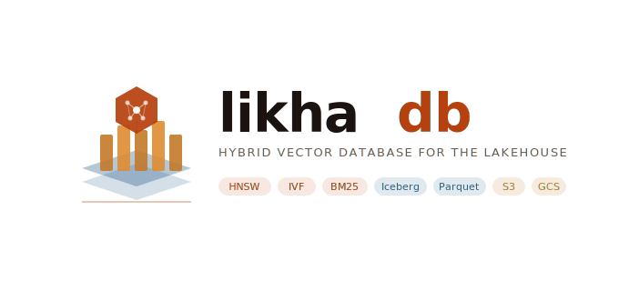
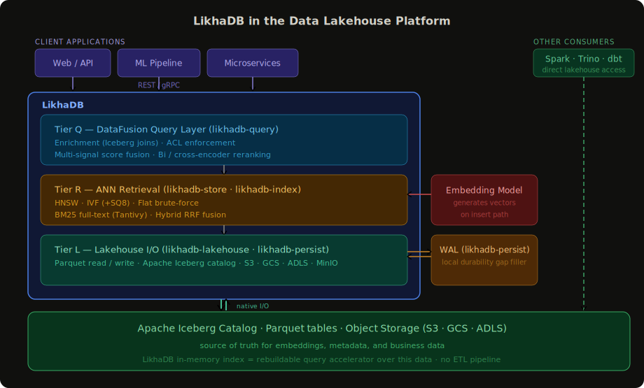

# likhadb

<p align="center">
  
</p>

**The hybrid vector database built for the data lakehouse.**
Fast Rust-native search (HNSW, IVF, BM25 + RRF fusion) that reads and writes directly from Parquet, S3/GCS, and Iceberg — no ETL pipeline required.

For a deep dive into crate structure, index algorithms, query flows, and persistence
design, see [`docs/ARCHITECTURE.md`](docs/ARCHITECTURE.md).

## Platform placement

<p align="center">
  
</p>

> LikhaDB bridges client applications and the data lakehouse. Client applications query it over REST/gRPC. Internally it runs three layers: **Tier Q** (DataFusion enrichment, ACL, reranking), **Tier R** (ANN recall: HNSW, IVF, BM25), and **Tier L** (Parquet/Iceberg I/O). The WAL buffers writes locally until they flush to the Iceberg staging tier. Other lakehouse tools (Spark, Trino, dbt) continue reading the same Iceberg tables directly — no duplication.

## Getting started

**Prerequisites:** Rust stable toolchain.

```sh
# Run all tests
cargo test --workspace

# Run FTS tests (requires the fts feature)
cargo test -p likhadb-store --features fts
cargo test -p likhadb-fts

# Run benchmarks
cargo bench -p likhadb-bench

# Stress test (requires a running server — see §Stress test below)
cargo run -p likhadb-stress

# Lint (zero warnings enforced)
cargo clippy --workspace -- -D warnings
cargo clippy -p likhadb-store --features fts -- -D warnings
```

## Index types

| Index | Type | When to use |
|---|---|---|
| `FlatIndex` | Exact brute-force | Small datasets or when precision matters most |
| `IvfIndex` | Approximate (IVF k-means) | Large datasets, latency-sensitive workloads |
| `IvfIndex` + SQ8 | Approximate + quantized | Memory-constrained deployments (4× smaller) |
| `HnswIndex` | Approximate (graph) | Sub-millisecond recall on large datasets |

## Python SDK

A typed Python client ships under `sdk/python/`. It supports both sync and async usage and covers the full REST API surface.

**Install (development):**

```sh
cd sdk/python
pip install -e ".[dev]"
```

**Sync usage:**

```python
from likhadb import LikhaDB

with LikhaDB("http://localhost:8080") as db:
    db.create_collection("docs", dim=384, metric="cosine")
    col = db.collection("docs")
    col.insert(1, vector=[0.1] * 384, payload={"title": "hello"})
    results = col.search([0.1] * 384, k=5, include_payload=True)
```

**Async usage:**

```python
from likhadb import AsyncLikhaDB

async with AsyncLikhaDB("http://localhost:8080") as db:
    await db.create_collection("docs", dim=384, metric="cosine")
    col = db.collection("docs")
    await col.insert(1, vector=[0.1] * 384, payload={"title": "hello"})
    results = await col.search([0.1] * 384, k=5, include_payload=True)
```

Index types (`flat`, `ivf`, `ivf_sq8`, `hnsw`), hybrid search, Parquet import/export, and per-request payload filters are all supported. See [`sdk/python/`](sdk/python/) for the full API.

## Distance metrics

| Metric | Formula | Best for |
|---|---|---|
| `Metric::L2` | `sqrt(Σ(aᵢ − bᵢ)²)` | General-purpose, unnormalised embeddings |
| `Metric::Cosine` | `1 − dot(a,b) / (‖a‖·‖b‖)` | Semantic similarity, text embeddings |
| `Metric::Dot` | `−Σ(aᵢ·bᵢ)` (negated so lower = better) | Pre-normalised vectors, recommendation |

## Benchmark results

### Apple M2

Measured on Apple M2 (aarch64). SIMD kernels via [`simsimd`](https://github.com/ashvardanian/SimSIMD) (NEON).
Rayon uses the default thread pool (all available cores).

#### FlatIndex (exact search)

| Benchmark | Vectors | Dim | k | Scalar | SIMD (1 thread) | SIMD + rayon | vs scalar |
|---|---|---|---|---|---|---|---|
| `1k_d128`   |   1 000 | 128 | 10 | 80.5 µs | 55.3 µs | 70.3 µs | **1.1×** |
| `10k_d384`  |  10 000 | 384 | 10 | 2.80 ms | 0.888 ms | 0.396 ms | **7.1×** |
| `100k_d384` | 100 000 | 384 | 10 | 26.5 ms | 8.84 ms | 2.82 ms | **9.4×** |

#### IvfIndex (approximate search)

| Vectors | Dim | nlist | nprobe | Training (one-time) | Query latency | vs FlatIndex SIMD+rayon |
|---|---|---|---|---|---|---|
|  10 000 | 384 |  256 |  8 | 21.6 ms |  93.1 µs | **4.2×** |
|  10 000 | 384 |  256 | 32 | 21.6 ms | 141 µs   | **2.8×** |
| 100 000 | 384 | 1024 | 16 | 320 ms  | 272 µs   | **10.4×** |
| 100 000 | 384 | 1024 | 64 | 320 ms  | 554 µs   | **5.1×** |

#### IvfIndex + SQ8 (approximate, 4× smaller posting lists)

| Vectors | Dim | nlist | nprobe | Query latency | vs IvfIndex (f32) |
|---|---|---|---|---|---|
|  10 000 | 384 |  256 |  8 | 342 µs | 0.27× |
|  10 000 | 384 |  256 | 32 | 648 µs | 0.22× |
| 100 000 | 384 | 1024 | 16 | 848 µs | 0.32× |
| 100 000 | 384 | 1024 | 64 | 1.92 ms | 0.29× |

#### HnswIndex (graph-based approximate search)

| Vectors | Dim | m | ef_construction | ef_search | Query latency | vs FlatIndex SIMD+rayon |
|---|---|---|---|---|---|---|
|  10 000 | 384 | 16 | 200 |  50 | 146 µs | **2.7×** |
|  10 000 | 384 | 16 | 200 | 100 | 233 µs | **1.7×** |
| 100 000 | 384 | 16 | 200 |  50 | 167 µs | **16.9×** |
| 100 000 | 384 | 16 | 200 | 100 | 320 µs | **8.8×** |

**Build time** (one-time, amortised across all queries):

| Vectors | Dim | m | ef_construction | Build time |
|---|---|---|---|---|
| 10 000 | 384 | 16 | 200 | 4.57 s |

**Notes:**
- `nprobe=16` on 100 k vectors (1.6% of clusters) delivers **10.4× speedup** over exact SIMD+rayon search.
- SQ8 reduces posting-list memory 4× but is slower per query due to asymmetric decode overhead; best for memory-constrained deployments.
- At 1 k vectors, Rayon dispatch overhead exceeds the parallelism benefit — SIMD alone is faster.
- HNSW at `ef_search=50` on 100 k vectors achieves **16.9× speedup** vs exact SIMD+rayon with sub-200 µs latency.

### Apple M4 Mac Mini (16 GB RAM)

Measured on Apple M4 Mac Mini, 16 GB RAM (aarch64). SIMD kernels via [`simsimd`](https://github.com/ashvardanian/SimSIMD) (NEON).
Rayon uses the default thread pool (all available cores).

#### FlatIndex (exact search)

| Benchmark | Vectors | Dim | k | Scalar | SIMD (1 thread) | SIMD + rayon | vs scalar |
|---|---|---|---|---|---|---|---|
| `1k_d128`   |   1 000 | 128 | 10 | 34.6 µs | 27.2 µs | 55.4 µs | 0.6× |
| `10k_d384`  |  10 000 | 384 | 10 | 1.30 ms | 0.603 ms | 0.230 ms | **5.6×** |
| `100k_d384` | 100 000 | 384 | 10 | 13.9 ms | 5.72 ms | 1.41 ms | **9.8×** |

#### IvfIndex (approximate search)

| Vectors | Dim | nlist | nprobe | Training (one-time) | Query latency | vs FlatIndex SIMD+rayon |
|---|---|---|---|---|---|---|
|  10 000 | 384 |  256 |  8 | 13.5 ms |  84.5 µs | **2.7×** |
|  10 000 | 384 |  256 | 32 | 13.5 ms |  95.5 µs | **2.4×** |
| 100 000 | 384 | 1024 | 16 | 193 ms  | 197 µs   | **7.2×** |
| 100 000 | 384 | 1024 | 64 | 193 ms  | 335 µs   | **4.2×** |

#### IvfIndex + SQ8 (approximate, 4× smaller posting lists)

| Vectors | Dim | nlist | nprobe | Query latency | vs IvfIndex (f32) |
|---|---|---|---|---|---|
|  10 000 | 384 |  256 |  8 | 222 µs | 0.38× |
|  10 000 | 384 |  256 | 32 | 286 µs | 0.33× |
| 100 000 | 384 | 1024 | 16 | 568 µs | 0.35× |
| 100 000 | 384 | 1024 | 64 | 1.16 ms | 0.29× |

#### HnswIndex (graph-based approximate search)

| Vectors | Dim | m | ef_construction | ef_search | Query latency | vs FlatIndex SIMD+rayon |
|---|---|---|---|---|---|---|
|  10 000 | 384 | 16 | 200 |  50 | 103 µs | **2.2×** |
|  10 000 | 384 | 16 | 200 | 100 | 178 µs | **1.3×** |
| 100 000 | 384 | 16 | 200 |  50 | 128 µs | **11.0×** |
| 100 000 | 384 | 16 | 200 | 100 | 225 µs | **6.3×** |

**Build time** (one-time, amortised across all queries):

| Vectors | Dim | m | ef_construction | Build time |
|---|---|---|---|---|
| 10 000 | 384 | 16 | 200 | 3.07 s |

**Notes:**
- `nprobe=16` on 100 k vectors (1.6% of clusters) delivers **7.2× speedup** over exact SIMD+rayon search.
- SQ8 reduces posting-list memory 4× but is slower per query due to asymmetric decode overhead; best for memory-constrained deployments.
- At 1 k vectors, Rayon dispatch overhead exceeds the parallelism benefit — SIMD alone is faster.
- HNSW at `ef_search=50` on 100 k vectors achieves **11.0× speedup** vs exact SIMD+rayon with sub-130 µs latency.
- IVF training is ~40% faster than M2 (13.5 ms vs 21.6 ms at 10 k vectors), HNSW build is ~33% faster (3.07 s vs 4.57 s at 10 k vectors).

### Lakehouse I/O — MinIO (local)

Measured against a local MinIO instance running via OrbStack on the same host (loopback only, no network hop).
Export serialises the collection to Parquet in memory then uploads with a single HTTP PUT; import downloads with a single HTTP GET then deserialises.

| Vectors | Dim | Parquet size | Export | Import | Round-trip |
|---|---|---|---|---|---|
| 1 000 | 8 | ~24 KB | — | — | **~180 ms** |

**Notes:**
- Round-trip time is dominated by two HTTP calls to localhost (PUT + GET); Parquet serialisation/deserialisation is sub-millisecond at this scale.
- The `minio` feature is zero-cost when unused — it adds no dependencies to the default build.
- Reproduce with a running local MinIO:
  ```
  MINIO_ENDPOINT=http://localhost:9000 MINIO_BUCKET=likhadb \
  MINIO_ACCESS_KEY=minioadmin MINIO_SECRET_KEY=minioadmin \
  cargo test --features minio -p likhadb-lakehouse -- minio_real --ignored --nocapture
  ```

## Stress test

`likhadb-stress` is a breaking-point stress tester that pushes the server beyond normal operational limits to find where it breaks, validate error handling under pressure, and verify SLO compliance. It runs five sequential phases:

| Phase | What it does |
|---|---|
| **1. Baseline** | Inserts and queries across flat, IVF, and HNSW indexes plus a hybrid BM25+vector collection — establishes normal-load throughput and latency percentiles |
| **2. Ramp** | Doubles concurrency from 1 → 2 → 4 → … → `--max-concurrency`, stopping when error rate exceeds `--error-threshold` or p99 breaches `--p99-slo-ms` — reports the breaking point |
| **3. Spike** | Warm-up at base concurrency → sudden burst to `--spike-factor×` concurrency → recovery; reports p99 degradation ratio and whether the system recovers cleanly |
| **4. Soak** | Sustained load for `--soak-secs` split into 5 equal windows; compares first vs. last window p95 to detect latency drift from memory leaks or lock contention |
| **5. Chaos** | Fires a 1:1:1:1:1 mix of valid queries, valid inserts, ghost-collection queries, wrong-dimension inserts, and nonexistent-vector GETs; counts unexpected 5xx separately from expected 4xx; confirms server health after the barrage |

Every HTTP call goes through `send_timed()` which enforces `--timeout-ms` per request. All five phases report error rates, not just latency.

**Quick start** — with a running server (`./dev.sh`):

```sh
# Full run (all five phases, default settings)
cargo run -p likhadb-stress

# Stress phases only, shorter duration
cargo run -p likhadb-stress -- \
  --skip-baseline \
  --soak-secs 15 \
  --chaos-ops 500

# Force-detect a breaking point at low concurrency (useful for CI)
cargo run -p likhadb-stress -- \
  --skip-baseline \
  --max-concurrency 16 \
  --error-threshold 1.0 \
  --p99-slo-ms 200
```

**Key flags:**

| Flag | Default | Description |
|---|---|---|
| `--timeout-ms` | 5000 | Per-request timeout in milliseconds (0 = disabled) |
| `--max-concurrency` | 64 | Concurrency ceiling for the ramp phase |
| `--error-threshold` | 5.0 | Error rate % that declares a breaking point |
| `--p99-slo-ms` | 500 | p99 latency SLO in milliseconds |
| `--spike-factor` | 4 | Concurrency multiplier for the spike phase |
| `--soak-secs` | 30 | Duration of the soak phase |
| `--chaos-ops` | 1000 | Number of random operations in the chaos phase |
| `--skip-{baseline,ramp,spike,soak,chaos}` | — | Individually disable any phase |
| `--no-cleanup` | — | Retain test collections for post-run inspection |

## Roadmap

| Item | Status | Description |
|---|---|---|
| **A — Foundation** | Done | Exact brute-force search, in-memory, JSON metadata filtering |
| **B — Approximate k-NN** | Done | IVF (k-means + SQ8 quantization) + HNSW graph-based search |
| **C — Persistence** | Done | Snapshot + WAL crash durability, atomic checkpoint |
| **D — Concurrency** | Done | `Arc<RwLock<WalManager>>`, background checkpoint task |
| **E — API** | Done | HTTP REST (axum) + gRPC (tonic) |
| **F — Observability** | Done | Prometheus metrics (`/metrics`) + structured JSON tracing |
| **F1 — Full-text search** | Done | Tantivy BM25 index per collection, opt-in via `fts` feature |
| **F2 — Hybrid search** | Done | RRF fusion of vector similarity + BM25 scores |
| **L — Lakehouse I/O** | In Progress | Parquet import/export to MinIO/S3-compatible object stores (`minio` feature); GCS and Iceberg planned |
| **Q — DataFusion pipeline** | In Progress | Post-ANN enrichment, ACL enforcement, multi-signal score fusion, reranking (`likhadb-query` crate) |
| **T — Vector transforms** | Planned | Insert-time L2 normalisation, scalar scaling |
