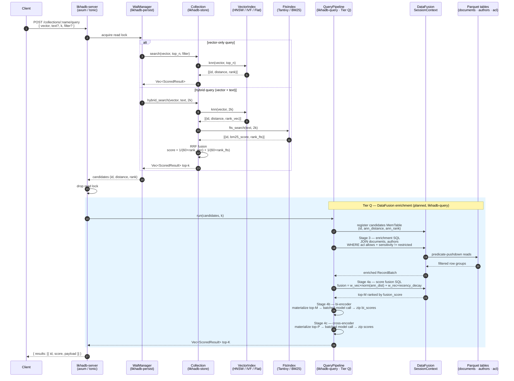

# LikhaDB Architecture

## What LikhaDB Is

LikhaDB is a hybrid vector database designed for the data lakehouse. It provides fast approximate nearest-neighbour (ANN) search and full-text search that reads and writes directly in Parquet, Apache Iceberg, and cloud object storage — without requiring an ETL pipeline to feed a separate vector store.

## The Problem

Traditional vector databases are standalone systems: you extract data from your data lake, transform it, and load it into the vector store. This model has compounding costs:

1. **Data duplication** — embeddings and metadata are duplicated between the lakehouse and the vector store. Every update in the lakehouse requires a corresponding update to the vector store.
2. **Staleness** — the vector store is eventually consistent with the lakehouse. Synchronisation pipelines introduce latency, operational complexity, and additional failure modes.
3. **Limited richness at query time** — standalone vector stores have no natural way to join ANN candidates with business data for enrichment, ACL enforcement, or multi-signal scoring. That logic ends up scattered across application code.
4. **Two systems to operate** — the lakehouse and the vector store have separate monitoring, scaling, and access control surface areas.

LikhaDB's goal is to eliminate this split. It is a first-class citizen of the lakehouse: it reads embeddings from Parquet and Iceberg, writes results back in the same format, and uses Apache DataFusion — the same query engine powering many modern lakehouse toolchains — as the post-retrieval execution layer.

## Mental Model

```
Lakehouse (Iceberg / Parquet on object storage)
         ↕  native read / write
LikhaDB — ANN index + FTS + query pipeline
         ↕  REST / gRPC
Your application
```

The ANN index (HNSW, IVF, or flat brute-force) is LikhaDB's *recall layer*. Its sole responsibility is: given a query vector, return the top-N most similar candidate IDs and their distances, fast.

Everything downstream of recall — metadata enrichment, ACL enforcement, multi-signal score fusion, and reranking — is handled by Apache DataFusion. DataFusion's columnar SQL execution engine can join the small candidate set against large Iceberg tables with predicate pushdown and partition pruning, making it the right tool for this second stage.

The source of truth for embeddings, metadata, and business data is the Iceberg catalog on cloud object storage. LikhaDB's in-memory index is a *query accelerator* over that data, not an independent store. When the index is cold or empty, it is rebuilt from Iceberg. When new data arrives in Iceberg, the index is updated to reflect it.

## Architecture Layers

```
┌──────────────────────────────────────────────────────────────┐
│                   Application / API layer                    │
│              REST (port 8080)  +  gRPC (port 50051)          │
└────────────────────────────┬─────────────────────────────────┘
                             │
┌────────────────────────────▼─────────────────────────────────┐
│              Tier Q — DataFusion Query Layer                  │
│    Enrichment · ACL enforcement · Score fusion · Reranking   │
└────────────────────────────┬─────────────────────────────────┘
                             │
┌────────────────────────────▼─────────────────────────────────┐
│              Tier R — ANN Retrieval                          │
│         HNSW · IVF · FlatIndex · BM25 · Hybrid RRF           │
└────────────────────────────┬─────────────────────────────────┘
                             │
┌────────────────────────────▼─────────────────────────────────┐
│              Tier L — Lakehouse I/O                          │
│          Parquet · Object storage · Apache Iceberg           │
└──────────────────────────────────────────────────────────────┘
```

### Query flow

End-to-end path from client request to ranked response, covering both the current ANN+RRF path and the planned DataFusion enrichment tier (Tier Q):



> **Tier Q note:** stages inside the blue box are implemented by the `likhadb-query` crate (currently in progress — Q0 config/error done; Q1–Q4 planned). Without Tier Q the server returns the ANN/RRF result directly.

For a deeper walkthrough of each stage see [`rfc/rfc_datafusion_integration.md`](rfc/rfc_datafusion_integration.md) and [`docs/ARCHITECTURE.md`](docs/ARCHITECTURE.md).

See [`docs/quick-usages.md`](docs/quick-usages.md) for Rust API and REST usage examples.


### Tier L — Lakehouse I/O

This tier is what makes LikhaDB a lakehouse-native system rather than an isolated database. It handles reading and writing vector data in formats that are already standard across the lakehouse ecosystem.

**Parquet** is the canonical format for embedding tables. LikhaDB can bulk-import vectors and metadata from any Parquet file that carries a `FixedSizeList<f32>` column for embeddings and export collections back to Parquet for downstream consumption.

**Object storage** (S3, GCS, ADLS) — the planned next step — removes the requirement to materialise files locally. Parquet is read and written directly from cloud object storage, so LikhaDB can sit in the same VPC as the rest of the lakehouse infrastructure without local disk dependencies.

**Apache Iceberg** is the target long-term data source. Iceberg's partitioning model (by embedding model version, by time) maps directly onto two important LikhaDB needs: clean cutover when a new embedding model is deployed, and efficient time-based pruning during enrichment queries. Registering an Iceberg catalog at startup makes all Iceberg tables queryable via DataFusion SQL, enabling the enrichment and scoring pipeline to join against production data without any duplication.

The design principle is: **LikhaDB should not own the data**. The lakehouse owns the data; LikhaDB accelerates queries over it.

### Tier R — ANN Retrieval

The retrieval tier has a single responsibility: given a query vector, return the top-N most similar candidates as fast as possible.

Three index types cover the recall–memory–latency trade-off space:

| Index | Characteristics |
|---|---|
| `FlatIndex` | Exact brute-force; perfect recall; best suited for small collections |
| `IvfIndex` | Approximate; k-means clustering; optional SQ8 quantisation for 4× memory reduction |
| `HnswIndex` | Approximate; hierarchical proximity graph; sub-200µs on 100k vectors |

All three are interchangeable behind a common `VectorIndex` contract, so the rest of the system — the store layer, the API layer, the DataFusion pipeline — does not care which index backs a given collection. The choice is a deployment parameter tuned to dataset size and latency budget.

**Full-text search** is available as an opt-in layer alongside any vector index. When enabled, all string fields in the JSON payload are indexed for BM25 search (via Tantivy). Full-text results are fused with vector results using Reciprocal Rank Fusion (RRF).

**Hybrid search** is the combination of vector ANN and BM25 text search via RRF:

```
rrf_score(id) = 1/(k + rank_vector) + 1/(k + rank_fts)
```

A document that ranks 2nd by vector similarity and 3rd by keyword relevance will outscore a document that is first in only one modality. This is the right default for knowledge retrieval workloads where the query has both semantic and lexical intent — neither signal alone is sufficient.

### Tier Q — DataFusion Query Layer (in design)

After the ANN index returns a candidate set (typically 100–500 IDs with their distances), the DataFusion layer takes over. It handles all the business logic that the ANN index is not designed to handle.

**Stage 1 — Enrichment.** The candidate IDs are registered as a small in-memory Arrow table. DataFusion joins this table against the relevant Iceberg tables (document text, author metadata, timestamps, sensitivity labels, access control lists). Because the candidate set is tiny (the build side of a hash join), DataFusion's optimizer automatically applies hash-build-on-candidates and probes the large Iceberg tables, with Parquet row-group-level predicate pushdown eliminating most of the data from the scan before it is read.

**Stage 2 — ACL enforcement.** Access control predicates are expressed as SQL `WHERE` clauses evaluated inside the enrichment stage. This is intentional: ACL enforcement happens in one place, is expressed as auditable SQL, and is applied before any scoring or model inference touches restricted data. There is no separate access-control lookup in application code.

**Stage 3 — Score fusion.** Multiple signals are combined into a single `fusion_score` using a weighted normalised sum computed with SQL window functions:

```
fusion_score = Σ (weight_i × normalised_signal_i)
```

Min-max normalisation uses `MAX() OVER ()` window functions within the candidate set — no precomputed global statistics are required. Signals include vector distance, recency decay, author authority, and content quality. Weights are configuration-driven, validated at startup to sum to 1.0.

**Stage 4 — Reranking.** Two-stage reranking narrows the candidate set further using learned models:
- A *bi-encoder* pass scores the top-M candidates using the query and each document's text representation, combining this score with the fusion score to produce top-P candidates.
- A *cross-encoder* pass performs full query-document interaction scoring on top-P, producing the final top-K results.

Both stages use the *materialise-then-call* pattern: the RecordBatch is collected out of DataFusion, a single batched model call is made, and scores are zipped back to IDs. This is the correct pattern because DataFusion's execution model is synchronous; embedding blocking HTTP calls inside a UDF would stall the tokio thread pool under concurrent load.

**Why DataFusion?** Because the enrichment problem is fundamentally a join problem. The candidate set (~500 rows) is tiny; the Iceberg tables it must join against are not. DataFusion's optimizer, with Iceberg partition pruning and Parquet column projection, handles this efficiently without custom code. SQL window functions handle normalisation cleanly. SQL predicates are auditable. This is the kind of work a columnar query engine is built for, and it separates business logic from retrieval logic cleanly.

## The Query Pipeline

```
1.  Application submits query (text + optional vector)
2.  LikhaDB embeds the text query → query vector
3.  ANN index returns top-N candidates (id, distance, rank)
4.  [If hybrid] BM25 index returns top-N text candidates
5.  [If hybrid] RRF fuses vector and BM25 ranks → merged candidate set
6.  DataFusion registers candidate set as in-memory table
7.  DataFusion enriches candidates by joining against Iceberg tables
8.  DataFusion enforces ACL: filter out documents the caller cannot access
9.  DataFusion computes fusion_score (multi-signal, normalised, weighted)
10. Bi-encoder narrows top-M candidates to top-P using combined score
11. Cross-encoder produces final top-K results
12. Response returned with enriched metadata
```

Steps 6–11 are the DataFusion layer. At the current state of the project, the pipeline runs through step 5 and returns the fused candidates directly. Steps 6–11 are the planned Tier Q work.

## Durability and State

LikhaDB uses a **Write-Ahead Log + periodic snapshot** model. Every mutation is durably logged before being applied in memory. Periodic checkpoints collapse the WAL into a compact snapshot image. On restart, the snapshot is loaded and WAL entries after the checkpoint are replayed.

The durability contract is: **no committed operation is lost if the process crashes**. The WAL covers the gap between checkpoints; the snapshot avoids replaying the entire write history on startup.

As the Iceberg integration matures, the durability story shifts. Because Iceberg is the authoritative source of truth, the ANN index becomes rebuildable from the catalog on a cold start. The WAL's role shrinks to covering the gap between Iceberg ingestion events and the live index — a much shorter window than today.

## Expected Future State

When fully realised, LikhaDB will:

**Be the search layer of a lakehouse, not a parallel system.** Embeddings live in Iceberg tables partitioned by model version and ingestion time. LikhaDB's ANN index is loaded from and synced back to those tables. There is no duplication, no ETL pipeline, no synchronisation lag.

**Enforce data access at query time, in one place.** ACL is expressed as SQL over the Iceberg `access_control` table, evaluated inside DataFusion during enrichment. The access control logic is in one place, is testable, and is applied before any scoring or reranking touches restricted data.

**Return semantically rich results without external orchestration.** A single query to LikhaDB returns results that have been enriched with business metadata, scored by multiple signals, and reranked by a cross-encoder. The caller does not orchestrate this pipeline; LikhaDB owns it end-to-end.

**Scale without operational complexity.** Because the source of truth is Iceberg on object storage, the in-memory ANN index is stateless and rebuildable. Multiple LikhaDB instances share the same Iceberg catalog and operate independently. The index is an acceleration layer, not a single point of failure for data availability.

**Support multi-modal and multi-signal retrieval extensibly.** The scoring model is open: new signals (social engagement, explicit user feedback, freshness) are expressed as columns in the Iceberg enrichment tables and added to the DataFusion scoring SQL with a corresponding weight in the `scoring.weights` config block. No index code changes.

## Design Principles

**The index is not the database.** LikhaDB's ANN index accelerates queries over data that the lakehouse owns. The lakehouse is the authoritative store; the index is derived and rebuildable. This keeps the data architecture simple: one source of truth.

**Separation of recall from relevance.** The ANN index is optimised for recall and latency. All business logic — enrichment, access control, multi-signal scoring, reranking — runs downstream in DataFusion. Each layer is independently tunable without affecting the other.

**Hybrid by default.** Combining vector similarity and BM25 text search consistently outperforms either signal alone on knowledge retrieval tasks. RRF is a principled, parameter-light fusion method. LikhaDB makes hybrid search a first-class primitive, not an afterthought.

**Lakehouse formats, not proprietary formats.** Embeddings are stored in Parquet. Tables are managed by Iceberg. Any tool that reads Parquet or Iceberg can read LikhaDB's data. There is no vendor lock-in at the storage layer.

**SQL as the business logic layer.** Enrichment, ACL enforcement, and score fusion are expressed in SQL, not scattered across application code. This makes business logic auditable, independently testable, and decoupled from the retrieval path.
